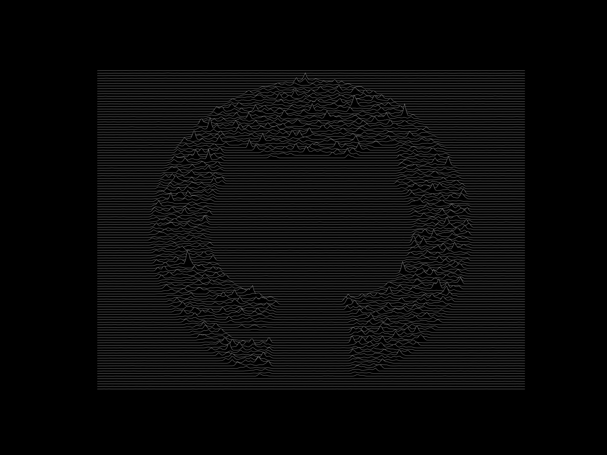
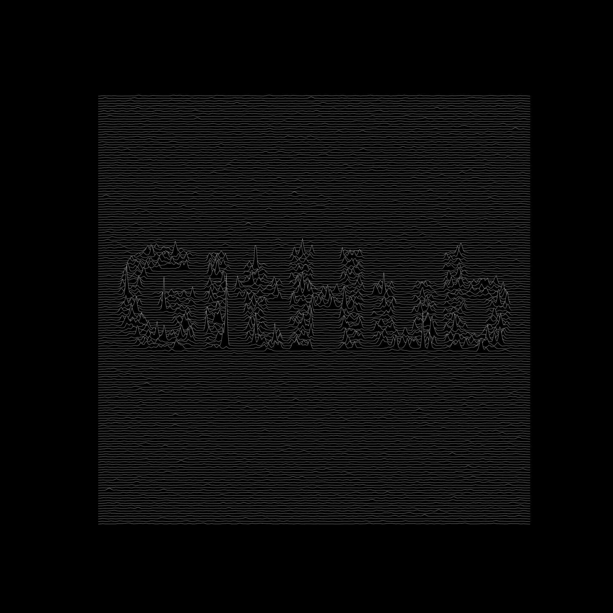
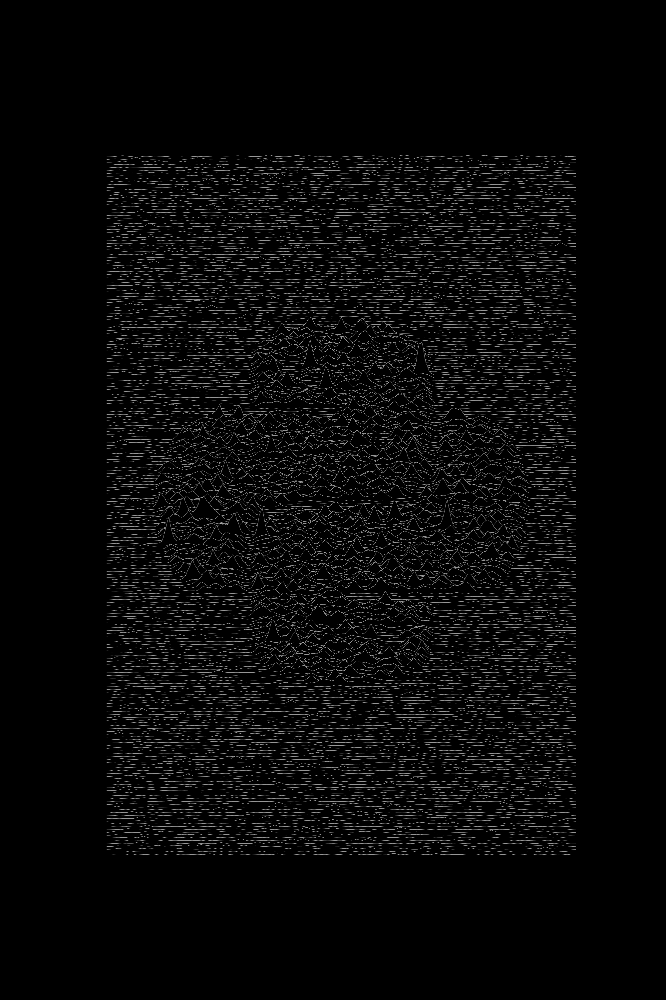

# joy waves

Style images as the cover of ["Unknown pleasures"](https://en.wikipedia.org/wiki/Unknown_Pleasures).

Works best with high contrast images.






## Usage

```
usage: main.py [-h] [--no-d] [-d] [-t THRESHOLD] [--wl WAVE_LEN]
               [--wh WAVE_HEIGHT] [--sl SKIP_LINES] [--rh RESIZE_HEIGHT]
               [--ch CANVAS_HEIGHT] [--rm {GRAY,SAT}] [--nl NOISE_LEVEL]
               [--ns NOISE_SMOOTH]
               images [images ...]

positional arguments:
  images              Paths to images.

optional arguments:
  -h, --help          show this help message and exit
  --no-d
  -d, --d             Choose dark side. If true: dark colors -> waves, light
                      colors -> flat lines. Default: True
  -t THRESHOLD        Binary threshold. If 0 then don't use threshold.
                      Default: 0.2
  --wl WAVE_LEN       Signal smoothing parameter. Can be interpreted as wave
                      length. Default: 4
  --wh WAVE_HEIGHT    Signal amplitude scaling. Can be interpreted as reversed
                      wave height. Default: 10
  --sl SKIP_LINES     Number of lines to skip. Default: 2
  --rh RESIZE_HEIGHT  Resize height. Bigger - more info preserved from
                      original image. No sense to make it bigger than original
                      height. If less then or equal to 0 - use original image
                      height. Default: 0
  --ch CANVAS_HEIGHT  Canvas height. Height of result image. Default: 2000
  --rm {GRAY,SAT}     Read image in greyscale or as RGB and get saturation
                      after that. Default: GRAY
  --nl NOISE_LEVEL    Noise level. Default: 0.05
  --ns NOISE_SMOOTH   Noise smoothing factor. Default: 4
```